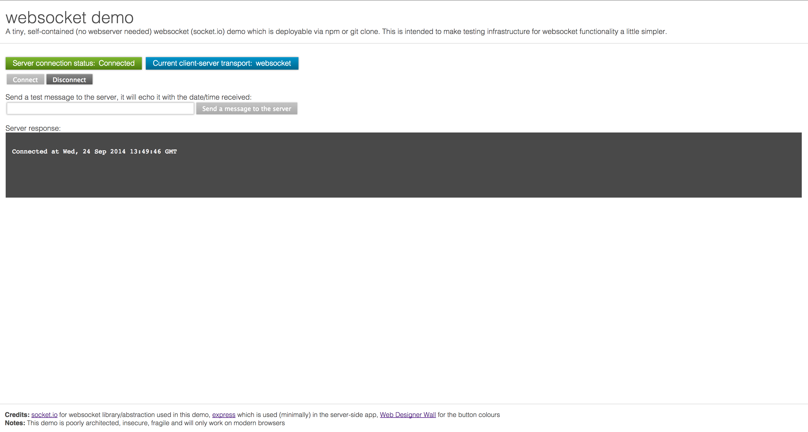

#TDP websocket demo

##Overview
A tiny, self-contained (no webserver needed) websocket (socket.io) demo which is deployable via npm or git clone. This is intended to make testing infrastructure for websocket functionality a little simpler.

##Requirements
NodeJS is required to run (as this is a node app) and either NPM or git to deploy (unless you're simply copying files manually in which case you require only NodeJS).

## Deploying
Either:  

NPM:
```
npm install tdp-websocket-demo
```

git:
```
git clone https://github.com/neilstuartcraig/websocketDemo.git
```

##Configuration
There is a (tiny) config file in /config of the files deployed. You can amend this if required, the default port (for no particular reason) which the app will listen on is 9001.

##Running
You need to invoke the main script which you can do (assuming you're in the root directory of the deployed files - which if you have installed via NPM will be node_modules/tdp-websocket-demo) like this:

```
node .
```

You then need to open a browser and visit the IP (or you can add a hosts file entry or even DNS if you really want) and visit http://127.0.0.1:9001 (replacing "127.0.0.1" and "9001" with your specifics).

From there, the simple UI will load and you can see the connection status, current trasport and echo app. The echo app is very simple, the server will just echo back what you type in the text box with a date/time after it.

The UI should look something like this:



That's pretty much it!

I built this to help test load balancer configs at work to ensure they support everything needed for websockets (very necessary if you have OSI layer >3 load balancing).

##Notes/known issues

* The web layout uses native (no browser prefixes) flexbox so it'll probably have some issues on anything except Chrome.
* Reconnect isn't working after disconnecting. I'm having trouble locating the cause of this, no doubt i'm doing somethign stupid - pull requests/suggestions very welcome

##License
This application is issued under a [Creative Commons attribution share-alike license](http://creativecommons.org/licenses/by-sa/4.0/deed.en_GB).
This means you can share and adapt the code provided you attribute the original author(s) and you share your resulting source code. If, for some specific reason you need to use this library under a different license then please contact me and i'll see what I can do - though I should mention that I am committed to all my code being open-source so closed licenses will almost certainly not be possible.
